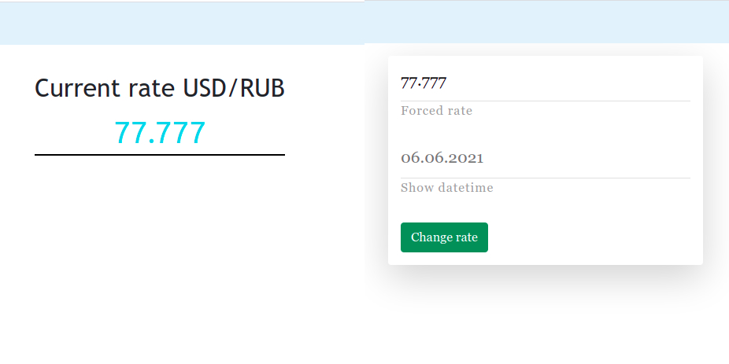

# Rate App
  Приложение по отображению актуального курса USD/RUB в зависимости от внутренней логики форсированного курса. Ознакомительная версия состоит из двух основных комнонентов - представление курса и изменение курса.

  

  Фронтенд Rails приложения реализован на фреймворке `Svelte`.

## Для запуска приложения локально:
  1. Склонировать проект (выполнять следующие команды из корня приложения)
  2. `$ bundle install`
  2. Набрать `$ make foreman` либо `foreman start -f Procfile.dev`

  Для человека не знакомого со средой разработки, для установки зависимостей - `$ bin/setup`

#### ToDo:
  + Добавить разделение ролей (оградить доступ к изменению курса всем)
  + Добавить больше валютных или криптовалютных пар
  + Добавить визуальные графики изменения цены под каждым, либо отдельной страницей
  + Воможность добавлять пары в избранное
  + Личный кабинет
  + Возможность менять частоту получения актуального курса
  + Добавить интренационализацию
